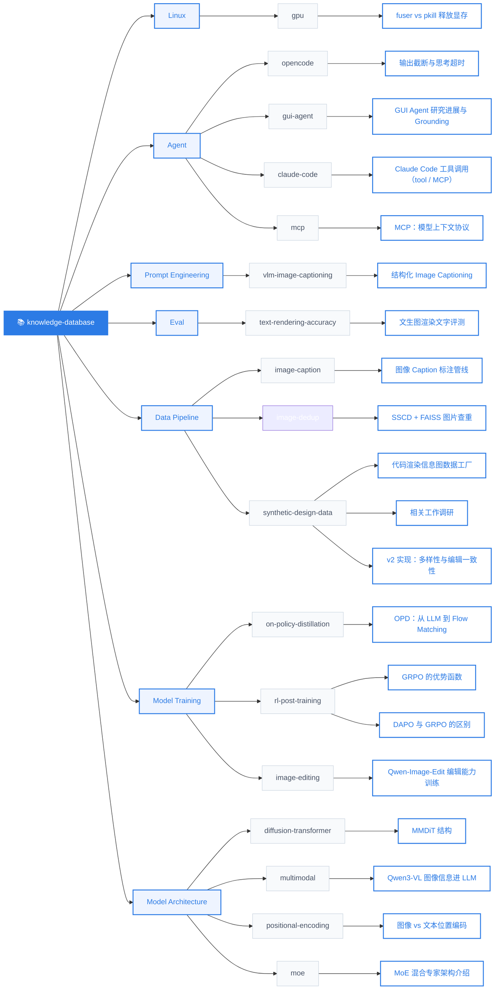

# knowledge-database

个人知识库。沉淀技术笔记、问题排查经验、命令技巧等。

**在线阅读：** https://caseclose.github.io/knowledge-database/

---

## 知识库总览



> 点击图中蓝色边框的知识条目可直接跳转阅读。

---

## ⚠️ 必读规则

**无论是人类还是 AI agent（大模型），在写入或修改本知识库的任何内容之前，必须先完整阅读本 README。**

不读本规则直接动手，视为违规操作。规则冲突时，以本文件为准。

---

## 目录结构

按技术领域分目录组织，可按需多层嵌套：

```
knowledge-database/
├── README.md              # 本文件，仓库规矩
├── linux/
│   └── gpu/
│       └── fuser-vs-pkill-release-gpu-memory.md
├── agent/
│   ├── opencode/
│   │   └── output-truncation-and-thinking-timeout.md
│   └── gui-agent/
│       └── gui-agent-research-progress-and-grounding.md
├── prompt-engineering/
│   └── vlm-image-captioning/
│       └── structured-image-captioning.md
├── eval/
│   └── text-rendering-accuracy/
│       └── text-to-image-render-text-eval.md
├── data-pipeline/
│   ├── image-caption/
│   │   └── image-caption-annotation-pipeline.md
│   ├── image-dedup/
│   │   └── sscd-faiss-image-deduplication.md
│   └── synthetic-design-data/
│       └── code-render-infographic-data-factory.md
├── model-serving/
│   └── vllm/
│       ├── glm52-dual-node-tp16-deploy.md
│       └── glm52-deploy-gotchas.md
├── model-training/
│   └── on-policy-distillation/
│       └── opd-from-llm-to-flow-matching.md
└── ...
```

- **一级目录**是大的技术领域，如 `linux`、`agent`、`prompt-engineering`、`eval`、`data-pipeline`、`model-serving`。
  - `prompt-engineering`：Prompt 设计技巧与模板，让模型按预期输出结构化结果。
  - `eval`：模型能力评测方法，包括指标设计、评测管线、看板对比。
  - `data-pipeline`：数据标注与处理管线，涵盖标注策略、工程架构、质量控制。
  - `model-serving`：模型部署与推理服务，包括 vLLM 集群搭建、性能调优、故障排查。
  - `model-training`：模型训练方法与范式，包括知识蒸馏、RL 后训练等。
- **二级目录**是具体子主题，如 `gpu`、`opencode`、`vlm-image-captioning`、`text-rendering-accuracy`、`image-caption`、`vllm`。
- 领域下可继续按子主题嵌套，如 `linux/gpu/`、`linux/shell/`。
- 不要在根目录直接堆放 `.md` 文件，所有知识必须归入对应领域目录。

## 文件命名

- 使用**英文小写 + 短横线**（kebab-case），例如 `fuser-vs-pkill-release-gpu-memory.md`。
- 文件名应能概括这条知识的主题，避免过于宽泛（如 `notes.md`、`tmp.md`）。
- 不要使用中文、空格、下划线或大写字母。

## 文件格式

每条知识是一个独立的 Markdown 文件，遵循以下结构：

1. **一级标题（`#`）**：一句话点明主题，用问句或陈述句均可。
2. **元信息**：标题下一行用引用写出创建/更新时间，可选标签：
   `> 创建时间：2026-08-20 ｜ 最新更新：2026-08-21 ｜ 标签：面试`
   多个标签用顿号分隔，如 `标签：面试、训练`。
3. **正文**：按需使用 `##` 二级标题划分小节，常见的有：
   - `## 现象` / `## 背景` — 问题描述
   - `## 原因` / `## 原理` — 分析解释
   - `## 解决方案` / `## 怎么做` — 操作步骤
   - `## 总结` — 要点归纳
4. **代码块**：命令和代码用 ``` 包裹，并标注语言。
5. **公式**：行内用一对 `$` 包裹 LaTeX，独立公式单独成段用 `$$` 包裹。站点会渲染成数学公式，不要把公式放进普通代码块。
6. **表格**：对比类内容优先用表格呈现。
7. 结尾可加一句 `> **一句话：**` 形式的要点总结。

> 结构是建议而非硬约束，内容驱动结构，能讲清楚最重要。

## 写作要求

- **可操作**：给出的命令、代码要能直接复制执行。
- **讲清为什么**：不止给做法，要解释原理，让读者能举一反三。
- **简洁**：不堆砌无关背景，每句话都有信息量。
- **中文为主**：正文用中文，命令、代码、专有名词保留英文。

## 新增知识

1. 确认所属领域，按需创建目录。
2. 用 kebab-case 命名文件。
3. 按「文件格式」撰写内容。
4. 提交 commit，message 用简洁祈使句，如 `add: fuser 释放 GPU 显存`。

## 修改知识

1. 先读原文件，理解现有结构与措辞。
2. 改动应保持文件风格一致。
3. 修正事实错误、补充新发现时，更新对应小节，不要另起炉灶。
4. commit message 如 `fix: 修正 fuser 命令示例`、`update: 补充 nvidia-smi 排查步骤`。

---

## 目录索引

| 路径 | 主题 |
|------|------|
| `linux/gpu/fuser-vs-pkill-release-gpu-memory.md` | `pkill` 不释放 GPU 显存时，用 `fuser` 强制清理 |
| `agent/opencode/output-truncation-and-thinking-timeout.md` | OpenCode 输出截断用精准续写，崩溃用 `--continue`，大任务分批 |
| `agent/gui-agent/gui-agent-research-progress-and-grounding.md` | GUI Agent 从坐标定位到长程计算机使用的研究进展与 Grounding 方法 |
| `prompt-engineering/vlm-image-captioning/structured-image-captioning.md` | 结构化 CoT Prompt 让 VLM 无损描述图片，喂给纯文本模型 |
| `eval/text-rendering-accuracy/text-to-image-render-text-eval.md` | 双 OCR 管线（WXGOCR + TextPecker）评测文生图渲染文字准确率 |
| `data-pipeline/image-caption/image-caption-annotation-pipeline.md` | 两阶段 VLM 直标 + Rewrite 融合的图像 Caption 标注管线 |
| `data-pipeline/image-dedup/sscd-faiss-image-deduplication.md` | SSCD 特征 + FAISS 近邻搜索 + 并查集聚类的图片查重方案 |
| `data-pipeline/synthetic-design-data/code-render-infographic-data-factory.md` | LLM 写代码→浏览器渲染→DOM 级标注，造信息图 T2I 图文对与像素级对齐编辑三元组 |
| `data-pipeline/synthetic-design-data/code-render-related-work-survey.md` | 代码渲染造图数据六条线索调研，论证「代码即数据引擎」优于扩散+OCR 回标 |
| `data-pipeline/synthetic-design-data/code-render-diversity-and-editing-implementation.md` | v2 落地：分层 style 采样/多画布/信息量四级/组件契约/多 code mode/交叉验证 |
| `model-serving/vllm/glm52-dual-node-tp16-deploy.md` | 双节点 16×H20 TP=16 部署 GLM-5.2-FP8，ray 编排 + Codex CLI 接入 |
| `model-serving/vllm/glm52-deploy-gotchas.md` | GLM-5.2 部署五坑（cu129 构建 / flashinfer 编译 / KV cache / 代理 / codex） |
| `model-training/on-policy-distillation/opd-from-llm-to-flow-matching.md` | OPD（在策略蒸馏）：student 采样 + teacher 密集监督，从 LLM 到 Flow Matching 的 9 篇论文脉络 |
| `model-training/rl-post-training/grpo-advantage-function.md` | GRPO 优势函数：组内奖励标准化 `A=(r−mean)/std` 取代 critic，std=0 时失去梯度 |
| `model-training/rl-post-training/dapo-vs-grpo.md` | DAPO = GRPO + 四补丁（Clip-Higher / Dynamic Sampling / Token-Level Loss / Overlong Shaping）并去 KL |
| `model-training/image-editing/qwen-image-edit-training.md` | Qwen-Image-Edit：VL 语义 + VAE 外观双编码，T2I/TI2I/I2I 多任务对齐潜空间 |
| `model-architecture/diffusion-transformer/mmdit-structure.md` | MMDiT：双流独立权重 + joint self-attention 取代 cross-attention，图文双向对齐 |
| `model-architecture/multimodal/qwen3-vl-vision-injection.md` | Qwen3-VL：merger 压缩视觉 token + DeepStack 残差注入 LLM 前几层 + interleaved-MRoPE |
| `model-architecture/positional-encoding/image-vs-text-positional-encoding.md` | 位置编码：文本 1D RoPE vs 图像 2D/axial RoPE，M-RoPE 统一多模态 t-h-w |
| `model-architecture/moe/moe-architecture-intro.md` | MoE：路由器 + top-k 专家稀疏激活，负载均衡（无辅助损失偏置）、细粒度 + 共享专家 |
| `agent/claude-code/tool-calling-and-mcp.md` | Claude Code：`while(tool_use)` agentic loop，内置工具与 MCP 同管线，Tool Search 控 token |
| `agent/mcp/model-context-protocol-intro.md` | MCP：host/client/server 的 JSON-RPC 插座，tools/resources/prompts，stdio 与 Streamable HTTP |
