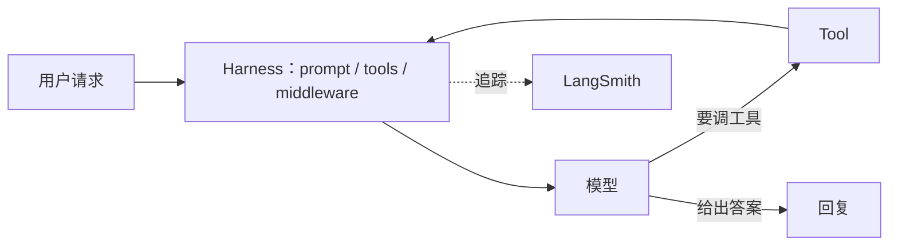

# LangChain 是什么：把 LLM 调用编排成应用

> 创建时间：2026-08-24 ｜ 最新更新：2026-08-24 ｜ 标签：面试

LangChain 是一套开源框架，用来把「一次 LLM API 调用」编排成可复用的应用：拼 prompt、换模型、接检索、调工具、跑 agent 循环。官方定位是 **Agent = Model + Harness**——模型负责想，框架提供循环、工具、中间件这些 harness。现行主线是 [LangChain 1.x](https://docs.langchain.com/oss/python/langchain/overview)（2025-10 起 1.0），高层 API 是 `create_agent`，底层运行时是 LangGraph。

它**不是**模型本身，也**不是**像 [MCP](../mcp/model-context-protocol-intro.md) 那样的协议。MCP 规定 host 怎么连外部 server；LangChain 规定你在 Python / JS 里怎么把模型、工具、状态组装起来。

## 背景：只调一次 API 不够

裸调 `chat.completions` 只能拿到一轮回复。真实应用通常还要：

| 需求 | 裸 API 要自己写 | LangChain 提供的 |
|------|-----------------|------------------|
| 换模型厂商 | 各家 SDK、消息格式不同 | 统一的 Chat Model / `init_chat_model` |
| 固定流程 | 手写「检索 → 填模板 → 调模型 → 解析」 | LCEL：`prompt \| model \| parser` |
| 查外部知识 | 自己切块、embedding、召回 | Retriever / RAG 组件 |
| 多步决策 | 自己写 [ReAct](../react/react-reasoning-and-acting.md) 循环 | `create_agent`（跑在 LangGraph 上） |
| 排障 | 散落的 print | LangSmith 链路追踪 |

所以面试里一句话：**LangChain 解决的是编排和集成，不是把模型变强。**

## 生态三件套

同一家公司、三层分工，不要混成一个词：

| 产品 | 管什么 | 什么时候用 |
|------|--------|------------|
| **LangChain** | 积木 + 高层 harness | prompt / 模型 / 工具 / 线性 chain；要 agent 先 `create_agent` |
| **LangGraph** | 有状态的图运行时 | 要循环、分支、checkpoint、人机暂停；LangChain agent 也跑在它上面 |
| **LangSmith** | 观测与评测 | 看每一步 LLM / tool 的输入输出、做 eval、对照失败轨迹 |

线性流水线用 LCEL 就够；一旦出现「看观察再决定下一步、可能绕回去」，就是图，不是 chain。



## 原理：Runnable 与 agent 循环

### LCEL：同一套接口串起来

Prompt、模型、输出解析器都实现 **Runnable**：`invoke` / `stream` / `batch`。用 `|` 拼成一条 chain，数据从左流到右：

```python
from langchain_core.prompts import ChatPromptTemplate
from langchain_core.output_parsers import StrOutputParser
from langchain.chat_models import init_chat_model

prompt = ChatPromptTemplate.from_template("用一句话解释：{topic}")
model = init_chat_model("openai:gpt-4.1")
chain = prompt | model | StrOutputParser()

print(chain.invoke({"topic": "LangChain"}))
```

这就是「chain」的本义：步骤固定、单向、无环。适合摘要、分类、RAG 问答（retriever 先查出文档再填进 prompt）。

### Agent：模型决定下一步

Agent 不是一条直线。模型和 [ReAct](../react/react-reasoning-and-acting.md) 一样：看上下文 → 选工具或收工 → 环境执行 → 观察写回 → 再想。差别是协议从纯文本 `Action:` 换成了各家的 **tool calling**，循环由 harness 跑，不必手写 parse。

`create_agent` 就是这层 harness 的默认实现，内部建一张 LangGraph：

```python
from langchain.agents import create_agent

def get_weather(city: str) -> str:
    """查询城市天气。"""
    return f"{city} 晴，25°C"

agent = create_agent(
    model="openai:gpt-4.1",
    tools=[get_weather],
    system_prompt="你是简洁的助手",
)

result = agent.invoke({
    "messages": [{"role": "user", "content": "旧金山天气？"}]
})
print(result["messages"][-1].content)
```

函数的名字、类型注解、docstring 会变成工具 schema，模型按 schema 填参。要持久状态、条件边、`interrupt()` 等人机回路，直接下沉写 `StateGraph`，不要继续往 LCEL 上叠 if/while。

## 和相邻概念怎么分

| | LangChain | MCP | 手写 ReAct |
|--|-----------|-----|------------|
| 是什么 | 应用编排框架 | host↔server 的协议 | Thought/Action/Observation 论文协议 |
| 换模型 | 换一个 Chat Model | 不管 | 不管 |
| 接工具 | Python 函数或集成包 | 任意语言的 MCP server | 自己 parse + 自己执行 |
| 循环谁写 | `create_agent` / LangGraph | host（如 Claude Code） | 你自己的 `while` |

可以同时用：LangChain agent 的某个 tool 里去调 MCP server；host 也可以不用 LangChain，只走 MCP。

## 实践里容易踩的点

- **抽象税**：简单「检索 + 生成」用 LCEL 三五行即可；一上来上 AgentExecutor 旧 API、自定义 callback 满天飞，后面难读。1.x 以 `create_agent` + LangGraph 为准，旧的 `Chain` / `initialize_agent` 当史料。
- **Chain ≠ Agent**：chain 不能自己决定绕回去；硬把 agent 需求塞进 `|` 管道，状态和重试都会拧。
- **工具描述就是 prompt**：schema 含糊，模型会乱调。和 MCP 一样，少而准比多而空强。
- **版本坑**：0.x 的 import 路径（`langchain.llms`、`LLMChain`）和 1.x 不通用；抄 2023 年博客会直接报错。
- **观测**：多步失败先看 LangSmith trace，再猜 prompt。没 trace 等于黑盒。

## 总结

| 层 | 记住什么 |
|----|----------|
| 目的 | 编排 LLM 调用：统一模型接口、拼 chain、跑 agent |
| 线性 | LCEL，`prompt \| model \| parser`，无环 |
| Agent | `create_agent` = 模型 + 工具 + 中间件，运行时是 LangGraph |
| 生态 | LangChain 搭积木，LangGraph 管有状态的图，LangSmith 看轨迹 |
| 边界 | 不替代 MCP，也不替代手写 ReAct 面试题 |

> **一句话：** LangChain 是 LLM 应用的编排框架——线性流程用 LCEL 管道，要循环决策用 `create_agent`（跑在 LangGraph 上），用 LangSmith 看每一步；它解决集成与控制流，不解决「模型够不够聪明」。
