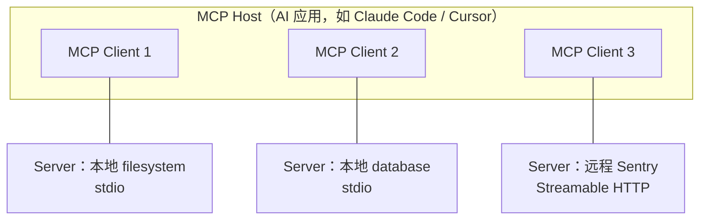

# MCP 是什么：给 LLM 接外部工具的开放协议

> 创建时间：2026-08-21 ｜ 最新更新：2026-08-21

MCP（Model Context Protocol，模型上下文协议）是一套开放的 JSON-RPC 协议，用来标准化「AI 应用」和「外部数据 / 工具」之间的连接。类比 LSP 让编辑器以同一套接口对接各种语言服务器：MCP 让 Claude Code、Cursor、VS Code 这类 **host** 以同一套接口对接 GitHub、数据库、文件系统、Sentry 等各种 **server**，而不用为每个 host 各写一套私有 plugin。

现行规范版本是 **2026-07-28**：请求自带版本与能力元数据，协议本身是**无会话状态**的。

## 背景：为什么需要 MCP

没有 MCP 时，每个 AI 应用都要自己发明「怎么声明工具、怎么调、怎么把结果塞回上下文」。结果是：

| | 没有 MCP | 有 MCP |
|---|---|---|
| 工具接入 | 每个 host 一套私有 API | server 写一次，多个 host 能连 |
| 模型看到的 | 各家 schema 各不相同 | 统一的 tools / resources / prompts |
| 部署 | 绑死在某一个客户端 | 本地进程或远程 HTTP 都能挂 |

MCP **不管** host 怎么选模型、怎么拼 prompt、怎么做权限 UI；它只规定上下文和能力怎么交换。

## 结构：Host / Client / Server



| 角色 | 是什么 | 干什么 |
|------|--------|--------|
| **Host** | 面向用户的 AI 应用 | 创建 client、汇总上下文、做权限与同意 |
| **Client** | host 里的连接器 | **一对一**连一个 server，收发 JSON-RPC |
| **Server** | 提供上下文的程序 | 暴露 tools / resources / prompts；可在本地或远程 |

一个 host 连 N 个 server，就创建 N 个 client。本地 stdio server 通常服务 1 个 client；远程 HTTP server 通常服务很多 client。

协议分两层：

- **数据层**：JSON-RPC 2.0，规定发现、原语、通知的语义。
- **传输层**：只负责把同样的 JSON-RPC 消息搬过去——本地用 **stdio**，远程用 **Streamable HTTP**（旧的 HTTP+SSE 已废弃）。

## 原理：模型并不直接连 MCP

模型永远只看到「有哪些工具、参数 schema 是什么」。真正的链路是：

```
模型决定 call tool
    → host 选对应的 MCP client
    → JSON-RPC tools/call
    → server 执行副作用 / 读数据
    → 结果回填进对话上下文
    → 模型继续
```

所以 MCP 是 **host 与外部世界的插座**，不是模型自己的 RPC。权限、确认、是否把某个 tool 塞进上下文，都由 host 决定。Claude Code 里 MCP 工具与内置工具走同一套管线，见 [Claude Code 的工具调用模式](../claude-code/tool-calling-and-mcp.md)。

现行规范里，每个请求在 `_meta` 里带上协议版本和 client 能力，server 可以**单独处理这一次请求**，不必先握手再建会话。想先摸清对面支持什么，发强制实现的 `server/discover`。

## 三种 server 原语

| 原语 | 谁用 | 典型方法 | 适合什么 |
|------|------|----------|----------|
| **Tools** | 模型决定何时调用 | `tools/list` → `tools/call` | 有副作用或要计算：查库、改文件、打 API |
| **Resources** | host 决定是否拉取 | `resources/list` → `resources/read` | 只读上下文：文件、schema、配置 |
| **Prompts** | 用户/host 选用模板 | `prompts/list` → `prompts/get` | 可复用的交互模板、few-shot |

一个数据库 server 可以同时提供：查询 tool、表结构 resource、带示例的 prompt。Client 还能暴露 **elicitation**（server 向用户要额外输入或确认）。`sampling`（server 反向要 host 去调 LLM）在 2026-07-28 已废弃，新实现应自己接模型 API。

## 传输怎么选

| 传输 | 场景 | 要点 |
|------|------|------|
| **stdio** | 本机子进程（filesystem、本地脚本） | host 拉起进程，用 stdin/stdout 交换消息，无网络开销 |
| **Streamable HTTP** | 远程服务（Sentry、自建 Worker） | 单一 MCP 端点，client 用 POST 发 JSON-RPC；可选用 SSE 流式回推。鉴权走 bearer / API key / OAuth |

2024-11-05 的 HTTP+SSE 已被 Streamable HTTP 取代，读旧博文时不要按那套实现新 server。

## 最小 server 示例

Python SDK 里一个 tool 就是一个 MCP server：

```python
from mcp.server.fastmcp import FastMCP

mcp = FastMCP("demo")

@mcp.tool()
def add(a: int, b: int) -> int:
    """把两个整数相加。"""
    return a + b
```

本地调试可用 [MCP Inspector](https://github.com/modelcontextprotocol/inspector)。host 侧（Cursor / Claude Code 等）把该进程登记成 stdio server，例如：

```json
{
  "mcpServers": {
    "demo": {
      "command": "uv",
      "args": ["run", "server.py"]
    }
  }
}
```

远程则改成 Streamable HTTP URL。模型之后会在 tool 列表里看到 `add`，参数由函数签名生成 JSON Schema。

## 实践里容易踩的点

- **Token 税**：host 常把每个 MCP tool 的完整 schema 塞进上下文。server 一多，窗口会被工具定义吃掉；host 侧会做按需加载（如 Claude Code 的 Tool Search），写 server 时 tool 要少、描述要短。
- **工具即任意代码**：描述文本不可信，host 必须对调用做用户同意；破坏性 tool 不要默认自动跑。
- **边界**：MCP 不保证「模型会正确用你的 tool」。schema 和 description 写清楚，比在 server 里猜模型意图更有效。
- **无状态**：2026-07-28 之后不要依赖会话级握手来存业务状态；要跨请求的状态放你自己的存储，或用可选的 Tasks 扩展做长任务句柄。

## 总结

| 层 | 记住什么 |
|----|----------|
| 目的 | 一套插座，避免每个 AI 应用私有对接外部系统 |
| 角色 | Host 管模型与权限；Client 一对一连 Server；Server 提供能力 |
| 原语 | Tools 给模型调用，Resources 给 host 拉上下文，Prompts 给模板 |
| 传输 | 本地 stdio，远程 Streamable HTTP；协议消息都是 JSON-RPC |
| 现状 | 2026-07-28 起请求自描述、协议无会话；sampling 已废弃 |

> **一句话：** MCP 是 AI 应用（host）与外部工具/数据（server）之间的 JSON-RPC 插座——client 一对一连接，server 用 tools / resources / prompts 暴露能力，本地走 stdio、远程走 Streamable HTTP；模型只通过 host 间接调用，并不自己连 MCP。
