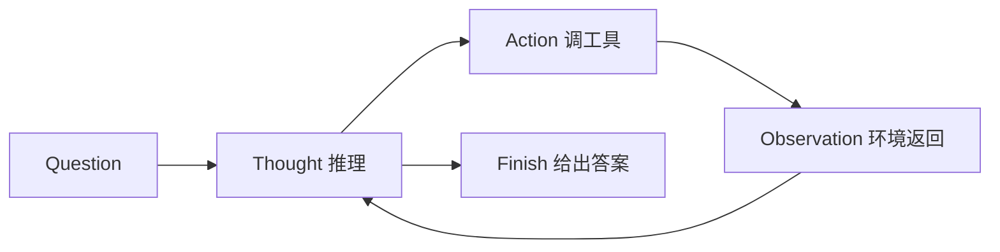

# ReAct：推理和行动怎么交错？

> 创建时间：2026-08-21 ｜ 最新更新：2026-08-21 ｜ 标签：面试

姚顺雨等人的 [ReAct](https://arxiv.org/abs/2210.03629)（ICLR 2023）把 LLM 的 **Reason（Thought）** 和 **Act（调工具）** 写成同一条轨迹，而不是「先想完再动手」或「只动手不想」。面试里说的「手写 ReAct」，就是把这个 **Thought → Action → Observation** 循环写出来。

和现在 Claude Code 那种 [JSON `tool_use` 循环](../claude-code/tool-calling-and-mcp.md) 是同一类东西：模型决定下一步，环境执行，观察写回上下文。ReAct 用的是**纯文本协议**（`Thought:` / `Action:` / `Observation:`），不依赖模型原生 function calling。

## 结构



| 步骤 | 谁产生 | 写进上下文的内容 |
|------|--------|------------------|
| **Thought** | 模型 | 当前该搜什么、已经知道什么、下一步假设 |
| **Action** | 模型 | `工具名[参数]`，例如 `Search[姚顺雨]`、`Finish[答案]` |
| **Observation** | **环境 / harness**，不是模型编的 | 检索结果、页面片段、报错 |

三条都进 **scratchpad**（轨迹），下一步生成时整段再喂给模型。这就是「交错」：想一步、做一步、看一步，而不是 CoT 一次想完。

和另外两条基线的差别：

| | 轨迹里有什么 | 典型失败 |
|--|--------------|----------|
| **CoT** | 只有 Thought | 事实会幻觉，没法查外部 |
| **Act-only** | 只有 Action / Observation | 多跳时乱点工具，缺少「为什么查这个」 |
| **ReAct** | Thought + Action + Observation | 解析失败、死循环、观察太长撑爆上下文 |

论文在 HotpotQA / ALFWorld / WebShop 上的点是：有环境反馈后，推理能被纠正；有推理后，动作更像在跟一个计划，而不是乱搜。

## 手写：面试版循环

白板不需要 LangChain。核心就四件事：**拼 prompt、解析 Action、执行工具、把 Observation 追加回去**。

```python
import re

SYSTEM = """You are a ReAct agent. Solve the question with this format:
Thought: <why this step>
Action: <tool>[<argument>]
Available tools:
- Search[query]: search Wikipedia-like knowledge
- Lookup[keyword]: find a sentence in the last search result
- Finish[answer]: stop and return the answer
After each Action you will get Observation, then continue.
""".strip()

ACTION_RE = re.compile(
    r"Thought:\s*(.*?)\s*Action:\s*(\w+)\s*\[(.*)\]",
    re.DOTALL | re.IGNORECASE,
)


def parse_output(text: str):
    """从模型输出里抠 Thought / Action / argument。"""
    m = ACTION_RE.search(text)
    if not m:
        raise ValueError(f"unparseable: {text!r}")
    thought, tool, arg = m.group(1).strip(), m.group(2), m.group(3).strip()
    return thought, tool, arg


def react(question: str, llm, tools: dict, max_steps: int = 8) -> str:
    scratchpad = f"Question: {question}\n"
    for step in range(1, max_steps + 1):
        prompt = SYSTEM + "\n\n" + scratchpad
        # 停在 Observation 之前，强迫模型先 Thought+Action
        raw = llm(prompt, stop=["\nObservation:", "\nObservation "])
        thought, tool, arg = parse_output(raw)

        if tool.lower() == "finish":
            return arg

        if tool not in tools:
            obs = f"unknown tool {tool!r}, choose from {list(tools)}"
        else:
            obs = tools[tool](arg)

        scratchpad += (
            f"Thought {step}: {thought}\n"
            f"Action {step}: {tool}[{arg}]\n"
            f"Observation {step}: {obs}\n"
        )
    return "I cannot answer within the step budget."
```

工具本身可以极简（面试够用）：

```python
def search(query: str) -> str:
    # 真系统里这里是检索 / API / 浏览器
    return wiki_search(query)[:500]


def lookup(keyword: str) -> str:
    return wiki_lookup(keyword)


tools = {"Search": search, "Lookup": lookup}
answer = react("Which city hosted the Olympic Games when Yao Shunyu was born?", llm, tools)
```

论文原轨迹是 `Thought 1:` / `Action 1:` / `Observation 1:` 这种带步号的；上面为了对齐解析，生成时不强制步号，写回 scratchpad 时再标上。意思一样。

一条完整轨迹长这样：

```
Question: Author of ReAct also worked on which prompting method that searches a tree of thoughts?
Thought 1: ReAct 一作是姚顺雨，先搜他的工作。
Action 1: Search[Shunyu Yao Tree of Thoughts]
Observation 1: Tree of Thoughts (ToT) is a framework by Yao et al. that ...
Thought 2: 观察已经对上，可以收工。
Action 2: Finish[Tree of Thoughts]
```

## 实现时必写的护栏

面试常追问「就这些？循环不会炸吗」。至少要能答这几条：

1. `max_steps`：没有 `Finish` 就停，避免 Thought/Action 死循环。
2. `stop=["Observation:"]`：不让模型自己编 Observation；观察必须来自工具。
3. **解析失败**：输出不合 `Action: Tool[arg]` 时，把「格式错误」当成 Observation 再给一次机会，不要直接崩。
4. **未知工具**：同样写成 Observation，让下一步 Thought 改选。
5. **Observation 截断**：检索结果截到几百字，否则 scratchpad 指数膨胀。
6. **Finish 才是结束**：不要看到一段像答案的 Thought 就停；没调 `Finish` 就还在回路里。

和今天常见的 **native function calling**（Claude `tool_use`、OpenAI `tool_calls`）对照：

| | 文本 ReAct | Native tool call |
|--|-----------|------------------|
| 协议 | 自由文本 + 正则/状态机解析 | JSON schema，解码器约束 |
| Thought | 显式写在轨迹里 | 常在内部 reasoning / 也可以不露 |
| 脆弱点 | 格式一歪就 parse 失败 | schema 校验失败，但字段是结构化的 |
| 本质 | 同一套「模型选动作 → 环境执行 → 写回」 | 同一套，只是 Action 不再用字符串协议 |

所以可以说：Claude Code 的 `while(tool_use)` 是 ReAct 的结构化实现；ReAct 论文解决的是「**要不要想、想了怎么接上行动**」，不是某一个 SDK。

## 总结

| 要点 | 内容 |
|------|------|
| 交错 | 每一步都是 Thought + Action，用 Observation 校正下一步 |
| 环境 | Observation 必须是工具返回，禁止模型代写 |
| 结束 | 显式 `Finish[answer]`，外加步数上限 |
| 和 CoT | CoT 无环境；ReAct 把推理接到可执行动作上 |

> **一句话：** ReAct 就是「想一步、调一次工具、把观察写回上下文」的循环；手写时抓住 parse `Action: Tool[arg]`、环境填 Observation、`Finish` 才退出这三件事。
