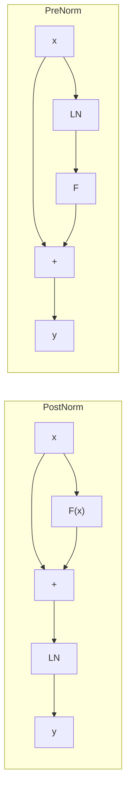

# BatchNorm、LayerNorm、PreNorm、PostNorm 怎么区分？

> 创建时间：2026-08-24 ｜ 最新更新：2026-08-24 ｜ 标签：面试

这四个词其实是**两根正交的轴**，不要捏成一种分类：

| 轴 | 问的是 | 选项 |
|----|--------|------|
| **沿哪一维归一化** | 均值/方差在哪个集合上算 | BatchNorm vs LayerNorm（以及 RMSNorm） |
| **残差外面还是里面** | Norm 相对 `x + F(x)` 放哪 | PreNorm vs PostNorm |

BatchNorm / LayerNorm 是**算子**；PreNorm / PostNorm 是 Transformer **块里的摆放**。现代 LLM 常见组合是 **LayerNorm（或 RMSNorm）+ PreNorm**，和 ResNet 里的 BatchNorm 不是同一套东西。

## 背景：为什么要归一化

深度网络里激活尺度会一层层漂。归一化把一组数拉到「均值约 0、方差约 1」，再乘可学习的 $\gamma$、加 $\beta$，让后面的线性层看到稳定的输入分布，梯度也更好走。差在：**这一组数包含哪些位置**。

对形状 $[N, L, C]$ 的序列（batch、长度、通道）：

$$
\hat{x} = \gamma \odot \frac{x - \mu}{\sqrt{\sigma^2 + \epsilon}} + \beta
$$

$\mu,\sigma$ 的统计范围一变，就是 BN 还是 LN。

## BatchNorm vs LayerNorm

| | BatchNorm | LayerNorm |
|--|-----------|-----------|
| 统计范围 | 同一通道、**跨样本**（卷积再加空间维） | **单个样本 / 单个 token** 的整段特征 |
| 依赖 batch 大小 | 强：batch 太小统计很噪 | 无 |
| 训练 / 推理 | 训练用当前 batch；推理用 `running_mean` / `running_var` | 两种模式公式一样 |
| 典型场景 | CNN、检测、有稳定大 batch 的视觉 | Transformer、NLP、可变长、小 batch |
| 和 `eval()` | 必须切对，否则用错统计量 | 前向不变，见 [`eval()` vs `train()`](../../model-training/pytorch/eval-vs-train.md) |

BatchNorm（特征图 $[N,C,H,W]$，对每个通道 $c$）：

$$
\mu_c = \mathrm{mean}_{n,h,w}(x_{\cdot c\cdot\cdot}), \quad
\sigma_c^2 = \mathrm{var}_{n,h,w}(x_{\cdot c\cdot\cdot})
$$

LayerNorm（序列 $[N,L,C]$，对每个 token $(n,\ell)$）：

$$
\mu_{n\ell} = \mathrm{mean}_{c}(x_{n\ell\cdot}), \quad
\sigma_{n\ell}^2 = \mathrm{var}_{c}(x_{n\ell\cdot})
$$

直观记：**BN 问「这个通道在这一批里长什么样」；LN 问「这个 token 自己的各维长什么样」。** 换一个 batch，BN 的 $\mu,\sigma$ 会变，LN 不会。所以变长序列、batch=1 的生成、数据并行切太碎时，BN 会抖，LN 稳。

LLM 里还常见 **RMSNorm**（LLaMA、Qwen 等）：不算均值、只除 RMS，也没有 $\beta$。它仍是「沿特征维、每个 token 独立」，和 LN 同一轴，只是公式更省。

```python
# 伪代码：只标统计轴
# x: [N, L, C]
bn_mu = x.mean(dim=(0, 1))          # 跨 batch 和长度，每个通道一个
ln_mu = x.mean(dim=-1, keepdim=True)  # 每个 token 自己的 C 维
```

## PreNorm vs PostNorm

这是 **Norm 和残差谁包谁**，与上面用 BN 还是 LN 无关。一块里通常是 Attention 或 FFN，记作 $F$。

**PostNorm**（原版 Transformer / Vaswani 2017）：先算子、再加残差、最后 Norm。

$$
y = \mathrm{LN}\bigl(x + F(x)\bigr)
$$

**PreNorm**（GPT-2 起主流）：先 Norm，再算子，残差从**未经 Norm 的 $x$** 直接加上去。

$$
y = x + F\bigl(\mathrm{LN}(x)\bigr)
$$



| | PostNorm | PreNorm |
|--|----------|---------|
| 残差路径 | 被 LN 挡一层，**不是纯恒等** | $x$ 原样加到输出，**恒等通路干净** |
| 深网训练 | 层一深就容易不稳，要 warmup / 小心初始化 | 深网好训，梯度能沿残差直达底层 |
| 最终效果 | 训得稳时，有时略好（浅网、原 BERT） | 现代深 LLM 的默认；末层常再补一个 LN |
| 代表 | 原版 Transformer、BERT | GPT-2/3、LLaMA、大多数 2020 年后的 decoder |

PreNorm 好训的原因：反向时 $\partial y/\partial x$ 里有一项恒为 $1$，梯度不会被中间层的 LN / 权重乘没。PostNorm 的 LN 包在残差外面，每层都在「改写」这条捷径，层数一多就容易梯度消失或尺度爆炸。

代价是：PreNorm 每层输出的尺度主要由残差累加决定，堆很深时激活会变大，所以模型最后（以及有的实现里每层后）还会再做一次 Norm。PostNorm 每层出口都被拉回单位尺度，表示更「干净」，但要先过得了训练。

## 面试里怎么答

1. 先拆两轴，再谈组合。
2. **视觉 CNN → BN +（残差块里的）Pre-Activation**；**语言模型 → LN/RMSNorm + PreNorm**。
3. 不要说「PreNorm 就是 LayerNorm」——Pre/Post 是位置，LN 是算法。
4. 提到 BN 一定带上：推理必须 `eval()`，用 running 统计量；LN 没有这套状态。
5. 补充一句 RMSNorm：现在开源 LLM 往往连 $\mu$ 都不减了。

## 总结

| 词 | 一句话 |
|----|--------|
| BatchNorm | 跨样本（和空间）按通道归一化，绑 batch，推理用 running 统计 |
| LayerNorm | 每个 token 沿特征维归一化，与 batch 无关 |
| PreNorm | $x + F(\mathrm{LN}(x))$，残差是纯捷径，深网好训 |
| PostNorm | $\mathrm{LN}(x + F(x))$，原版 Transformer，捷径被 LN 改写 |

> **一句话：** BN / LN 差在统计范围（跨 batch 的通道 vs 单个 token 的特征）；Pre / Post 差在 LN 放在残差里面还是外面——PreNorm 保住恒等通路所以好训深模型，现代 LLM 基本是 LN 或 RMSNorm 配 PreNorm。
